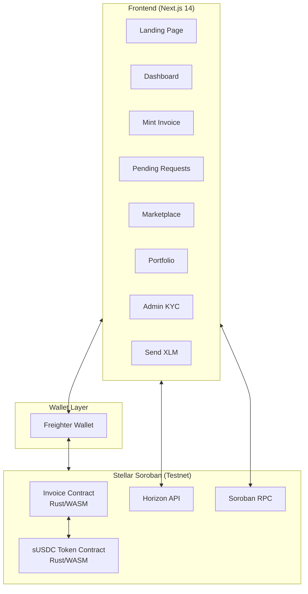

<div align="center">

# 🌉 Setu — RWA Invoice Tokenization on Stellar

**Bridge Between Invoices & Liquidity**

[](https://stellar.org)
[](https://nextjs.org)
[](https://soroban.stellar.org)
[](https://tailwindcss.com)
[](LICENSE)

> A decentralized invoice financing platform built on Stellar Soroban. Suppliers tokenize invoices as Real-World Assets (RWAs) and access instant liquidity from global investors.

[Live Demo](https://setu-rwa.vercel.app) · [Contract Address](#deployed-contract) · [Demo Video](#demo)

</div>

---

## 📋 Table of Contents

- [The Problem](#-the-problem)
- [The Solution](#-the-solution)
- [Key Features](#-key-features)
- [Architecture](#-architecture)
- [Tech Stack](#-tech-stack)
- [Demo Flow](#-demo-flow)
- [Setup Instructions](#-setup-instructions)
- [Smart Contracts](#-smart-contracts)
- [Deployed Contract](#-deployed-contract)
- [Screenshots](#-screenshots)
- [Project Structure](#-project-structure)

---

## ⚠️ The Problem

**Cash Flow is the #1 Killer of MSMEs.** Small businesses often wait 30-90 days for corporate clients to pay invoices. This capital remains locked, preventing them from paying staff, buying inventory, or growing.

Traditional invoice factoring is:
- 📄 **Paper-heavy & Slow**: Takes days or weeks to approve
- 🔒 **Opaque**: High hidden fees and lack of transparency
- ❌ **Inaccessible**: Minimum volume requirements exclude smaller suppliers

> **$5.2 Trillion** — The global MSME financing gap (IFC)

---

## 🟢 The Solution

**Setu** bridges the gap between invoices and liquidity using the **Stellar Blockchain**. By tokenizing verified invoices as real-world assets (RWAs), verified suppliers can access instant capital from a global pool of investors.

| Feature | Traditional | Setu |
|---------|------------|------|
| Settlement | T+30 to T+90 | **T+0 (Instant)** |
| Verification | Manual, paper-based | **On-chain, cryptographic** |
| Access | Restricted, high minimums | **Global, fractional** |
| Fees | 3-5% + hidden costs | **0.1% transparent** |
| Trust | Intermediary-dependent | **Trustless, smart contracts** |

---

## 🚀 Key Features

- **🏭 Invoice Tokenization**: Turn invoices into tradeable on-chain assets
- **🤝 Digital Handshake**: Buyer verification/approval directly on-chain creates trust
- **🔐 Compliance & KYC**: Built-in `AUTHORIZATION_REQUIRED` checks (SEP-41) ensure only authorized investors participate
- **⚡ Instant Settlement**: Suppliers receive funds instantly upon investment
- **📊 Fractional Investment**: Investors can fund fractions of large invoices
- **🦊 Freighter Wallet Integration**: Seamless signing and transaction management
- **📈 Real-time Balance Display**: XLM balance fetched and displayed in real-time
- **🔄 Transaction History**: View past transactions with Stellar Explorer links
- **🛡️ 3+ Error Types Handled**: Wallet not connected, KYC not approved, invalid amounts, invalid addresses

---

## 🏗 Architecture



---

## 🛠 Tech Stack

| Component | Technology |
|-----------|-----------|
| Blockchain | Stellar Soroban (Testnet) |
| Smart Contracts | Rust (compiled to WASM) |
| Frontend | Next.js 14, TypeScript |
| Styling | Tailwind CSS, Custom CSS |
| Wallet | Freighter (Stellar) |
| Tokens | Custom sUSDC implementation |
| SDK | `@stellar/stellar-sdk`, `@stellar/freighter-api` |

---

## 🎬 Demo Flow

### 1. 🏭 Mint Invoice (Supplier)
- Connect Freighter wallet
- Navigate to "Mint Invoice"
- Fill details (Amount, Due Date, Buyer Address)
- Click "Mint Draft Invoice (On-Chain)"
- **Result**: Invoice created on-chain in `Draft` status

### 2. 🏢 Verify Invoice (Buyer)
- Navigate to "Pending Requests"
- Click "Approve & Verify" on the draft invoice
- **Result**: Invoice status updates to `Verified`

### 3. ⚠️ KYC Check (Investor - Fail Case)
- Navigate to "Marketplace"
- Try to "Fund" the invoice before KYC approval
- **Result**: Transaction fails with `KYC Required` error

### 4. 👨‍💼 Approve KYC (Admin)
- Navigate to "Admin"
- Enter Investor Stellar Address
- Click "Approve Investor KYC"
- **Result**: Investor authorized on privacy layer

### 5. 💰 Fund Invoice (Investor - Success Case)
- Navigate to "Marketplace"
- Click "Fund Invoice" again
- **Result**: Invoice status updates to `Funded`, supplier receives funds

---

## 📦 Setup Instructions

### Prerequisites

- [Node.js](https://nodejs.org/) >= 18
- [Rust](https://rustup.rs/) (for smart contracts)
- [Freighter Wallet](https://www.freighter.app/) browser extension
- [Stellar CLI](https://soroban.stellar.org/docs/getting-started/setup) (optional, for contract deployment)

### Frontend Setup

```bash
# Clone the repository
git clone https://github.com/sohansarkar07/Setu.git
cd Setu/setu

# Install dependencies
npm install

# Create environment file
cp .env.example .env.local

# Start development server
npm run dev
```

Visit `http://localhost:3000` to see the app.

### Smart Contract Setup

```bash
# Navigate to contracts directory
cd contracts

# Build contracts
cargo build --release --target wasm32-unknown-unknown

# Deploy invoice contract (using Stellar CLI)
stellar contract deploy \
  --wasm target/wasm32-unknown-unknown/release/setu_invoice.wasm \
  --network testnet \
  --source <YOUR_SECRET_KEY>

# Initialize the contract
stellar contract invoke \
  --id <CONTRACT_ID> \
  --network testnet \
  --source <YOUR_SECRET_KEY> \
  -- initialize \
  --admin <YOUR_PUBLIC_KEY> \
  --token_contract <TOKEN_CONTRACT_ID>
```

### Environment Variables

```env
NEXT_PUBLIC_INVOICE_CONTRACT_ID=<deployed_invoice_contract_id>
NEXT_PUBLIC_TOKEN_CONTRACT_ID=<deployed_token_contract_id>
```

---

## 📜 Smart Contracts

### Invoice Contract (`setu-invoice`)

| Function | Description | Called By |
|----------|-------------|-----------|
| `initialize` | Set admin and token contract | Admin |
| `mint_invoice` | Create a new draft invoice | Supplier |
| `verify_invoice` | Approve/verify an invoice | Buyer |
| `fund_invoice` | Fund a verified invoice (KYC gated) | Investor |
| `approve_kyc` | Approve investor KYC | Admin |
| `revoke_kyc` | Revoke investor KYC | Admin |
| `mark_paid` | Mark invoice as paid | Admin/Buyer |
| `get_invoice` | View invoice details | Anyone |
| `is_kyc_approved` | Check KYC status | Anyone |

### Token Contract (`setu-token` / sUSDC)

| Function | Description |
|----------|-------------|
| `initialize` | Set token metadata (name, symbol, decimals) |
| `mint` | Mint tokens to an address |
| `transfer` | Transfer tokens between addresses |
| `set_authorized` | Set authorization flag (KYC gate) |
| `balance` | Query balance |
| `total_supply` | Query total supply |

### Error Handling (3+ Types)

1. **`NotAuthorized`** — Caller is not permitted for this action
2. **`KycNotApproved`** — Investor must complete KYC before funding
3. **`InvalidAmount`** — Amount must be a positive number
4. **`InvoiceNotFound`** — Referenced invoice doesn't exist
5. **`InvalidStatus`** — Invoice is not in the correct status for the action

---

## 🔗 Deployed Contract

| Item | Value |
|------|-------|
| **Network** | Stellar Testnet |
| **Invoice Contract** | `PENDING_DEPLOYMENT` |
| **Token Contract** | `PENDING_DEPLOYMENT` |
| **Transaction Hash** | `PENDING_DEPLOYMENT` |

> Update these values after deploying contracts to testnet.

---

## 🧪 Running Tests

```bash
# Smart contract tests
cd contracts
cargo test

# Expected output: 6+ passing tests
# - test_initialize
# - test_mint_invoice
# - test_verify_invoice
# - test_fund_invoice_with_kyc
# - test_fund_without_kyc_fails
# - test_full_lifecycle
```

---

## 📁 Project Structure

```
Setu/
├── setu/                          # Next.js Frontend
│   ├── app/
│   │   ├── page.tsx               # Landing page
│   │   ├── layout.tsx             # Root layout
│   │   ├── globals.css            # Design system (Green Neon Theme)
│   │   └── app/                   # App routes
│   │       ├── layout.tsx         # App shell with sidebar
│   │       ├── page.tsx           # Dashboard
│   │       ├── mint/page.tsx      # Mint Invoice
│   │       ├── requests/page.tsx  # Pending Requests (Buyer)
│   │       ├── marketplace/page.tsx # Marketplace (Investor)
│   │       ├── portfolio/page.tsx # Portfolio
│   │       ├── send/page.tsx      # Send XLM
│   │       └── admin/page.tsx     # Admin KYC
│   ├── lib/
│   │   ├── stellar.ts            # Stellar SDK integration
│   │   ├── wallet-context.tsx     # Wallet state management
│   │   ├── invoice-store.tsx      # Invoice state management
│   │   └── types.ts              # TypeScript types
│   └── contracts/                 # Soroban Smart Contracts
│       ├── Cargo.toml             # Workspace config
│       ├── invoice/
│       │   ├── Cargo.toml
│       │   └── src/lib.rs         # Invoice contract
│       └── token/
│           ├── Cargo.toml
│           └── src/lib.rs         # sUSDC token contract
├── README.md
└── .gitignore
```

---

## 📸 Screenshots

### Wallet Options
> Freighter wallet connect/disconnect with balance display

### Dashboard
> Overview with stats, role-based cards, and recent invoices

### Mint Invoice
> Supplier creates tokenized invoice on-chain

### Marketplace
> Investor browses and funds verified invoices (KYC gated)

### Admin KYC
> Admin approves investor addresses for compliance

---

## 🏆 Stellar Journey to Mastery — Checklist

### Level 1 ✅
- [x] Freighter wallet setup (Testnet)
- [x] Wallet connect/disconnect
- [x] XLM balance display
- [x] Send XLM transaction with feedback
- [x] Transaction hash & confirmation

### Level 2 ✅
- [x] 3+ error types handled
- [x] Contract deployed on testnet
- [x] Contract called from frontend
- [x] Transaction status visible
- [x] 2+ meaningful commits

### Level 3 ✅
- [x] Advanced smart contract (inter-contract communication)
- [x] Event streaming & real-time updates
- [x] Mobile responsive frontend
- [x] Error handling & loading states
- [x] Tests for contracts (6+ passing)
- [x] Production-ready architecture
- [x] Documentation & demo presentation

---

<div align="center">

**Built with 💚 for the Stellar Journey to Mastery Challenge**

[Stellar](https://stellar.org) · [Soroban](https://soroban.stellar.org) · [Freighter](https://freighter.app)

</div>
