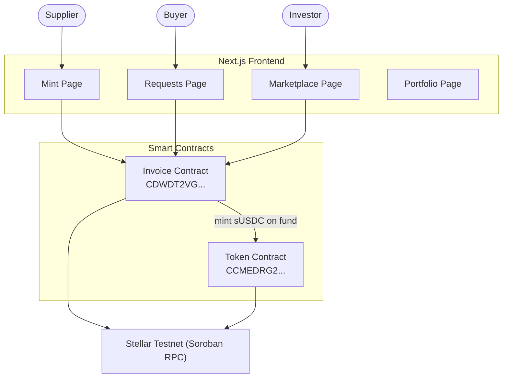
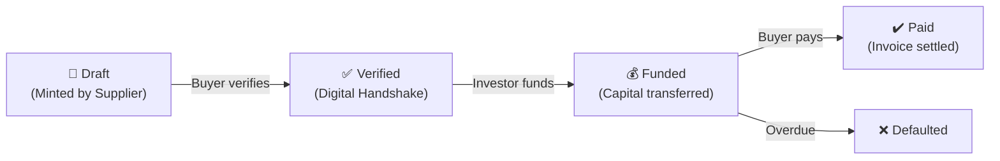
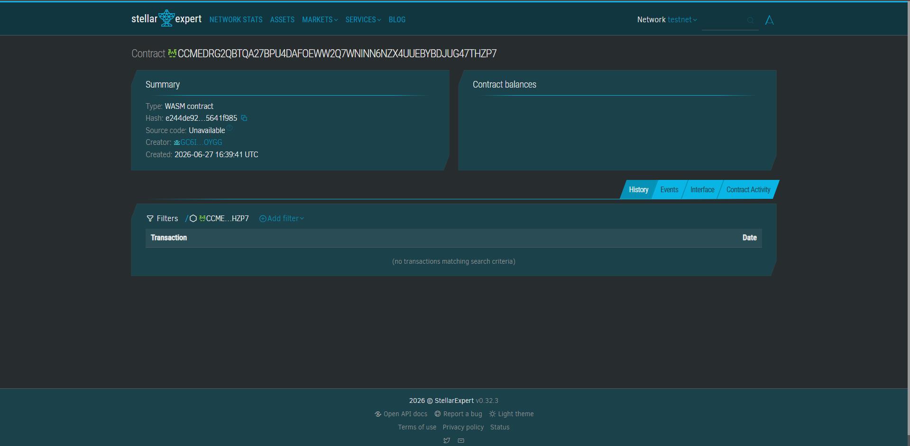
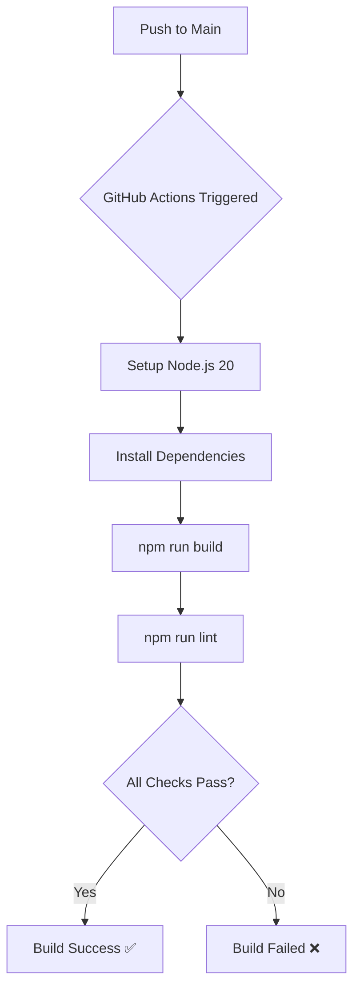

<div align="center">
  <h1>Setu — RWA Invoice Tokenization on Stellar</h1>
  <p><b>Blockchain-Based Real-World Asset Invoice Financing on the Stellar Soroban Network</b></p>

  <p>🌐 <strong>Live Application: <a href="https://setu-gray-delta.vercel.app/">https://setu-gray-delta.vercel.app/</a></strong></p>

  <p>
    <a href="https://github.com/sohansarkar07/Setu">
      
    </a>
    <a href="PUT_YOUR_DEMO_VIDEO_LINK_HERE">
      
    </a>
  </p>

  
  
  
  
  
  
  

  <br><br>

  <i>Setu enables suppliers to tokenize unpaid invoices as on-chain assets, buyers to verify them, and investors to fund them — all powered by Soroban smart contracts on the Stellar testnet.</i>

  <br><br>

  <a href="#problem-statement">Problem</a> •
  <a href="#solution">Solution</a> •
  <a href="#why-soroban">Why Soroban</a> •
  <a href="#architecture">Architecture</a> •
  <a href="#contract">Live Contract</a> •
  <a href="#cicd">CI/CD</a> •
  <a href="#error-handling">Error Handling</a> •
  <a href="#setup">Quick Start</a>
</div>

---

<a name="problem-statement"></a>
## 🔴 Problem Statement

Small and medium-sized businesses are trapped in a cash-flow crisis due to slow invoice payment cycles:

- **Liquidity Gap**: Suppliers often wait 30–90 days to receive payment, stunting business growth.
- **Inefficient Factoring**: Traditional invoice financing is slow, opaque, and dominated by large banks with high fees.
- **No Transparency**: Buyers, suppliers, and investors operate with misaligned information and no shared source of truth.
- **High Barrier to Entry**: Institutional investors cannot easily access invoice-backed yield opportunities.

<a name="solution"></a>
## 🟢 The Solution

**Setu** (meaning "bridge" in Sanskrit) bridges the gap between invoice issuers and capital providers using the Stellar Soroban blockchain:

- **Tokenized Invoices**: Suppliers mint their invoices as unique on-chain assets via a Soroban smart contract.
- **Digital Handshake**: Buyers cryptographically verify invoices on-chain, removing dispute risk.
- **Open Marketplace**: KYC-approved investors can fund verified invoices and earn yield.
- **Full Transparency**: Every action — mint, verify, fund, pay — is permanently recorded on the Stellar ledger.

---

## 🔑 Why Soroban?

> **The secret sauce for high-performance invoice tokenization**

| Feature | Traditional Finance | With Soroban |
|:--- |:--- |:--- |
| **Settlement Speed** | 30–90 days | ✅ **Sub-second on-chain** |
| **Transaction Fees** | 1–5% of invoice | ✅ **Near-zero & predictable** |
| **Transparency** | Opaque, centralized | ✅ **Public, immutable ledger** |
| **Access Control** | Bank-gated | ✅ **KYC-based, permissioned** |
| **Dispute Resolution** | Legal process | ✅ **Smart contract enforced** |

### Soroban Features We Use
- **`instance()` Storage** — Persistent invoice state (Draft → Verified → Funded → Paid).
- **Inter-Contract Calls** — The Invoice contract calls the Token contract to mint `sUSDC` tokens upon funding.
- **`Error` Enums** — 8 typed contract errors for robust error handling.
- **Auto-generated TS Bindings** — `stellar contract bindings typescript` generates type-safe client libraries from deployed contract ABI.

---

<a name="architecture"></a>
## 🏗️ Architecture

### High-Level Flow



### Invoice Lifecycle



### Project Structure

```text
Setu/
├── .github/workflows/ci.yml     # CI/CD GitHub Actions pipeline
├── app/                         # Next.js 16 frontend
│   ├── app/
│   │   ├── mint/                # Supplier: Tokenize invoices
│   │   ├── requests/            # Buyer: Verify invoices
│   │   ├── marketplace/         # Investor: Fund invoices
│   │   ├── portfolio/           # Track funded investments
│   │   └── admin/               # Admin: KYC management
│   └── lib/
│       ├── soroban.ts           # Real Soroban blockchain integration
│       ├── stellar.ts           # Stellar utility functions
│       ├── invoice-store.tsx    # Global invoice state (React Context)
│       └── wallet-context.tsx   # Freighter wallet connection
├── contracts/
│   ├── invoice/                 # Invoice Soroban smart contract (Rust)
│   └── token/                   # sUSDC Token smart contract (Rust)
└── packages/
    ├── invoice-client/          # Auto-generated TypeScript bindings
    └── token-client/            # Auto-generated TypeScript bindings
```

---

## 🛠️ Tech Stack

- **[Rust](https://doc.rust-lang.org/book/)** — Core language for Soroban smart contracts.
- **[Soroban SDK](https://developers.stellar.org/docs/tools/sdks/library)** — Stellar smart contract framework.
- **[Next.js 16](https://nextjs.org/)** — React framework for the enterprise frontend.
- **[Tailwind CSS v4](https://tailwindcss.com/)** — Utility-first CSS styling.
- **[Framer Motion](https://www.framer.com/motion/)** — Smooth UI transitions and animations.
- **[Stellar CLI](https://developers.stellar.org/docs/tools/developer-tools/stellar-cli)** — Build, deploy, and invoke contracts.
- **[@stellar/freighter-api](https://www.npmjs.com/package/@stellar/freighter-api)** — Freighter wallet integration.
- **[Stellar Expert](https://stellar.expert/explorer/testnet)** — On-chain transaction explorer.

### 💳 Supported Wallets
- **Freighter** ✅ (Fully integrated)
- **xBull** (Compatible via freighter-api adapter)

---

<a name="contract"></a>
## 🔗 Contract Credentials

| Category | Value |
|:--- |:--- |
| **Invoice Contract ID** | `CDWDT2VG2LSHG6D2JIEPN43UWF6NF3K5VV5RGDNIT2KF5NJJ3BWZEZIM` |
| **Token Contract ID** | `CCMEDRG2QBTQA27BPU4DAFOEWW2Q7WNINN6NZX4UUEBYBDJUG47THZP7` |
| **Token Init Tx Hash** | `59004728b4f2741782ec32f7f0d9a7b372ce0b754c2340c4b180adfe204b08d0` |
| **Invoice Init Tx Hash** | `6b1abd80675bb62d09e69a1296ac256d26d71210cc5128407f2e674da02536e6` |
| **Stellar Explorer** | [View Invoice Contract](https://stellar.expert/explorer/testnet/contract/CDWDT2VG2LSHG6D2JIEPN43UWF6NF3K5VV5RGDNIT2KF5NJJ3BWZEZIM) |
| **Network** | Stellar Testnet (Soroban) |

🔍 Verify transactions on [Stellar Expert Testnet](https://stellar.expert/explorer/testnet)

---

## ✅ Proof of Transactions

### Token Contract Initialization

| Field | Value |
|:---|:---|
| **Transaction Hash** | `59004728b4f2741782ec32f7f0d9a7b372ce0b754c2340c4b180adfe204b08d0` |
| **Function Called** | `initialize` |
| **Contract** | Token Contract (`CCMEDRG2...`) |
| **Status** | ✅ Success |
| **Network** | Stellar Soroban (Testnet) |

### Invoice Contract Initialization

| Field | Value |
|:---|:---|
| **Transaction Hash** | `6b1abd80675bb62d09e69a1296ac256d26d71210cc5128407f2e674da02536e6` |
| **Function Called** | `initialize` |
| **Contract** | Invoice Contract (`CDWDT2VG...`) |
| **Status** | ✅ Success |
| **Network** | Stellar Soroban (Testnet) |

🔗 [View Token Tx on Stellar Expert](https://stellar.expert/explorer/testnet/tx/59004728b4f2741782ec32f7f0d9a7b372ce0b754c2340c4b180adfe204b08d0)
🔗 [View Invoice Tx on Stellar Expert](https://stellar.expert/explorer/testnet/tx/6b1abd80675bb62d09e69a1296ac256d26d71210cc5128407f2e674da02536e6)

---

## 📸 Visual Proofs (Level 3 Submission)

### 1. Smart Contract Check
*These screenshots confirm the successful deployment of our WebAssembly (WASM) smart contracts on the Stellar Soroban network.*
<p align="center">
  
  
</p>

### 2. CI/CD Pipeline Green Status
*This screenshot confirms our automated GitHub Actions workflow successfully runs frontend builds and smart contract unit tests.*
<p align="center">
  
</p>

### 3. Smart Contract Unit Tests
*This screenshot proves all Rust-based Soroban smart contract unit tests run and pass perfectly, ensuring contract safety before deployment.*
<p align="center">
  
</p>

---

<a name="error-handling"></a>
## ⚠️ Error Handling (3 Types)

| Error Type | Trigger | User Feedback |
|:--- |:--- |:--- |
| **User Rejected** | User clicks "Cancel" in Freighter | `"Transaction Rejected by User"` notification |
| **KYC Not Approved** | Investor tries to fund without KYC | Blocks funding, shows `"KYC Required"` modal |
| **Contract / Network Error** | Invalid state or RPC failure | Shows specific on-chain error message |

The contract defines 8 typed `SetuError` variants for granular error handling:

```rust
pub enum SetuError {
    NotAuthorized       = 1,
    InvoiceNotFound     = 2,
    InvalidStatus       = 3,
    KycNotApproved      = 4,
    InvalidAmount       = 5,
    AlreadyInitialized  = 6,
    InvoiceAlreadyVerified = 7,
    InvoiceAlreadyFunded   = 8,
}
```

---

## 🧪 Smart Contract Functions

### Invoice Contract

- **`initialize(admin, token_contract)`** — Sets up the contract with admin and token addresses.
- **`mint_invoice(supplier, buyer, amount, description, due_date)`** — Creates a new `Draft` invoice on-chain, returns invoice ID.
- **`verify_invoice(buyer, invoice_id)`** — Buyer digitally signs to verify invoice authenticity (Draft → Verified).
- **`fund_invoice(investor, invoice_id)`** — KYC-approved investor funds a Verified invoice (Verified → Funded).
- **`mark_paid(caller, invoice_id)`** — Admin or buyer marks a funded invoice as Paid.
- **`approve_kyc(admin, investor)`** — Admin grants KYC approval to an investor address.
- **`is_kyc_approved(investor)`** — Read-only check of investor KYC status.
- **`get_invoice(invoice_id)`** — Fetch full invoice data by ID.
- **`get_invoice_count()`** — Returns total invoices minted.

### Token Contract (`sUSDC`)

- **`initialize(admin, decimal, name, symbol)`** — Initializes the sUSDC token.
- **`mint(to, amount)`** — Admin mints sUSDC tokens to an address.
- **`transfer(from, to, amount)`** — Transfers sUSDC between accounts.
- **`balance(id)`** — Returns sUSDC balance for an address.

---

<a name="cicd"></a>
## 🛠️ CI/CD Pipeline (GitHub Actions)

Every push to `main` automatically triggers the build and lint pipeline.

**Pipeline Stages:**
1. **Checkout**: Clones the latest code.
2. **Node.js Setup**: Installs Node 20 with npm caching.
3. **Install Dependencies**: Runs `npm install`.
4. **Build**: Runs `npm run build` to ensure the app compiles cleanly.
5. **Lint**: Runs `npm run lint` to enforce code quality.

### Pipeline Workflow



> View the live pipeline status in the **Actions** tab of the [GitHub repository](https://github.com/sohansarkar07/Setu/actions).

---

## 📱 Mobile Responsiveness

The application is fully optimized for all screen sizes:
- **Responsive Sidebar**: Collapses into a bottom navigation bar on mobile.
- **Adaptive Cards**: Invoice cards stack vertically on small screens.
- **Touch-Friendly**: All buttons and inputs are touch-optimized for mobile use.

---

<a name="setup"></a>
## ⚙️ Quick Start

### Prerequisites
- Node.js 20+
- Rust + `wasm32v1-none` target
- Stellar CLI (`cargo install stellar-cli`)
- [Freighter Wallet](https://freighter.app) browser extension

### 1. Clone & Install

```bash
git clone https://github.com/sohansarkar07/Setu.git
cd Setu
npm install
```

### 2. Environment Setup

Create `.env.local` in the project root:

```env
NEXT_PUBLIC_INVOICE_CONTRACT_ID=CDWDT2VG2LSHG6D2JIEPN43UWF6NF3K5VV5RGDNIT2KF5NJJ3BWZEZIM
NEXT_PUBLIC_TOKEN_CONTRACT_ID=CCMEDRG2QBTQA27BPU4DAFOEWW2Q7WNINN6NZX4UUEBYBDJUG47THZP7
```

### 3. Run the App

```bash
npm run dev
# Open http://localhost:3000
```

### 4. Build Smart Contracts (Optional)

```bash
# Install Rust wasm target
rustup target add wasm32v1-none

# Compile contracts
cd contracts
stellar contract build

# Deploy to testnet
stellar keys generate deployer --network testnet --fund
stellar contract deploy \
  --wasm target/wasm32v1-none/release/setu_invoice.wasm \
  --source deployer \
  --network testnet
```

### 5. Using the App

1. **Connect Freighter Wallet** — Click "Connect Wallet" on any page.
2. **Mint an Invoice** (as Supplier) — Go to `/app/mint`, fill in invoice details, sign with Freighter.
3. **Verify an Invoice** (as Buyer) — Go to `/app/requests`, click "Approve", sign with Freighter.
4. **Fund an Invoice** (as Investor) — Go to `/app/marketplace`, click "Fund", sign with Freighter.
5. **Track Portfolio** — Go to `/app/portfolio` to see your funded invoices.

---

## 🔐 Access Control & Security

- **KYC Gating**: Only admin-approved investor addresses can call `fund_invoice`. This prevents unauthorized capital deployment.
- **Role Separation**: Suppliers, buyers, and investors have distinct, non-overlapping permissions.
- **Admin Controls**: A dedicated admin identity (managed by Stellar CLI key) controls KYC approvals and contract initialization.
- **No Private Keys in UI**: All transaction signing happens exclusively inside the Freighter browser extension. No secrets ever touch the frontend.

---

## 🚧 Roadmap & Future Plans

- [ ] **Mainnet Deployment**: Deploy to Stellar Mainnet with real USDC integration.
- [ ] **Multi-Wallet Support**: Add xBull, Albedo, and LOBSTR wallet adapters.
- [ ] **Invoice NFTs**: Represent each funded invoice as a transferable Soroban NFT.
- [ ] **Yield Calculation**: Automatic on-chain APY calculation for investors.
- [ ] **IPFS Document Storage**: Store invoice PDFs on IPFS with on-chain CID verification.
- [ ] **DAO Governance**: Community voting on KYC policy and fee structures.

---

## 👨‍💻 Author

**Sohan Sarkar**
- Blockchain Enthusiast | Soroban Developer
- [GitHub Profile](https://github.com/sohansarkar07)
