<div align="center">
  <h1>Setu v2 — Production-Grade RWA Invoice Financing Protocol on Stellar Soroban</h1>
  <p><b>The First Invoice Financing Protocol on Stellar with Built-in Default Protection, AI Risk Scoring & Secondary Market Liquidity</b></p>

  <p>🌐 <strong>Live Application: <a href="https://setu-gray-delta.vercel.app/">https://setu-gray-delta.vercel.app/</a></strong></p>

  <p>
    <a href="https://github.com/sohansarkar07/Setu">
      
    </a>
    <a href="https://drive.google.com/file/d/1-d85kxqm7iEbpDjChgmTRqk1po3bMBlL/view?usp=drivesdk">
      
    </a>
  </p>

  
  
  
  
  
  
  
  

  <br><br>

  <i>Setu v2 transforms basic invoice tokenization into a full production-grade financial protocol — combining AI Risk Scoring, Reserve Pool default protection, and a Secondary Liquidity Market, all on Stellar Soroban.</i>

  <br><br>

  <!-- Application UI Screenshots -->
  <p align="center">
    
    
    <br>
    
    
  </p>

  <br><br>

  <a href="#problem-statement">Problem</a> •
  <a href="#solution">Solution</a> •
  <a href="#v2-features">v2 Features</a> •
  <a href="#market-opportunity">Market Opportunity</a> •
  <a href="#vision">Vision</a> •
  <a href="#why-soroban">Why Soroban</a> •
  <a href="#architecture">Architecture</a> •
  <a href="#ai-pipeline">AI Pipeline</a> •
  <a href="#user-flow">User Flow</a> •
  <a href="#contract">Live Contract</a> •
  <a href="#cicd">CI/CD</a> •
  <a href="#error-handling">Error Handling</a> •
  <a href="#setup">Quick Start</a>
</div>

---

<a name="problem-statement"></a>
## 🔴 Problem Statement

Small and medium-sized businesses are trapped in a cash-flow crisis due to slow invoice payment cycles:

- **Liquidity Gap**: Suppliers often wait 30–90 days to receive payment, stunting business growth.
- **Inefficient Factoring**: Traditional invoice financing is slow, opaque, and dominated by large banks with high fees.
- **No Transparency**: Buyers, suppliers, and investors operate with misaligned information and no shared source of truth.
- **High Barrier to Entry**: Institutional investors cannot easily access invoice-backed yield opportunities.
- **No Default Protection**: If a buyer defaults, investors suffer total loss with zero recourse mechanism.
- **No Risk Pricing**: Investors have no standardized way to assess credit risk before committing capital.
- **Illiquid Positions**: Once funded, invoice positions are locked with no way to exit before maturity.

<a name="solution"></a>
## 🟢 The Solution — Setu v2

**Setu** (meaning "bridge" in Sanskrit) bridges the gap between invoice issuers and capital providers using the Stellar Soroban blockchain, now upgraded with four production-grade layers:

- **Tokenized Invoices**: Suppliers mint their invoices as unique on-chain assets via a Soroban smart contract.
- **AI Risk Scoring**: Every invoice gets an on-chain risk tier (A/B/C) computed by Groq AI (Llama-3) before funding.
- **Reserve Pool**: A 2% automated skim on every funded invoice builds a shared default protection pool.
- **Secondary Market**: Investors can list funded invoice positions for sale — creating real liquidity from illiquid assets.
- **Full Transparency**: Every action — mint, verify, fund, pay — is permanently recorded on the Stellar ledger.

---

<a name="v2-features"></a>
## ⚡ Setu v2 — New Production Layers

| Layer | Feature | Status |
|:---|:---|:---:|
| 🛡️ **Reserve Pool** | 2% auto-skim → shared default protection pool | ✅ Live |
| 🤖 **AI Risk Scoring** | Groq Llama-3 assigns A/B/C tier on every invoice | ✅ Live |
| 🔄 **Secondary Market** | List, buy and trade invoice positions with real liquidity | ✅ Live |
| 🔐 **Admin Access Control** | Super-admin wallet + delegate admin system | ✅ Live |
| 📊 **Dynamic Analytics** | Live stats: Volume, Avg Discount, Reserve Balance | ✅ Live |
| 🧪 **Smart Contract Tests** | 6/6 Soroban unit tests passing in CI | ✅ Live |

---

<a name="market-opportunity"></a>
## 📈 Market Opportunity

> The global invoice financing market is one of the largest untapped opportunities in fintech.

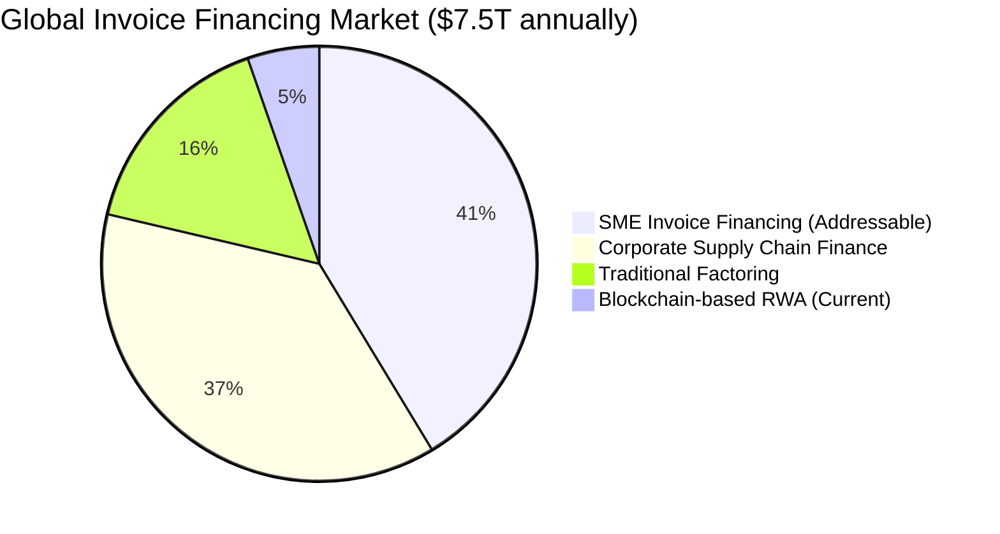
```mermaid
pie title Global Invoice Financing Market ($7.5T annually)
    "SME Invoice Financing (Addressable)" : 3100
    "Corporate Supply Chain Finance" : 2800
    "Traditional Factoring" : 1200
    "Blockchain-based RWA (Current)" : 400
```

| Market Segment | Size | Setu's Angle |
|:---|:---|:---|
| **Global Invoice Financing** | $7.5 Trillion/yr | Direct addressable market |
| **SME Financing Gap** | $5 Trillion/yr (World Bank) | Core underserved customer |
| **Blockchain RWA Market** | $16B by 2030 (projected) | Stellar-native positioning |
| **Invoice Factoring Fees** | 1–5% of invoice value | Setu charges sub-1% |
| **Payment Delay Average** | 30–90 days | Setu settles in seconds |

### Why Now?

- Stellar's Soroban smart contract platform enables sub-cent transaction fees — making micro-invoice financing economically viable for the first time.
- AI (LLMs like Groq/Llama) can now evaluate financial risk at near-zero cost, democratizing credit scoring previously available only to institutions.
- Real World Assets (RWA) tokenization is Stellar's #1 strategic priority — Setu is positioned at the intersection of all three.

---

<a name="vision"></a>
## 🔭 Vision & Use Cases

### Vision Statement

> *Setu v2 will become the foundational protocol layer for invoice financing across Southeast Asia and emerging markets — giving every SME access to institutional-grade capital on terms that used to require a bank.*

### Use Cases

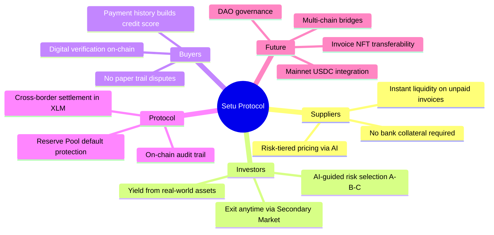
```mermaid
mindmap
  root((Setu Protocol))
    Suppliers
      Instant liquidity on unpaid invoices
      No bank collateral required
      Risk-tiered pricing via AI
    Investors
      Yield from real-world assets
      AI-guided risk selection A-B-C
      Exit anytime via Secondary Market
    Buyers
      Digital verification on-chain
      Payment history builds credit score
      No paper trail disputes
    Protocol
      Reserve Pool default protection
      On-chain audit trail
      Cross-border settlement in XLM
    Future
      Mainnet USDC integration
      DAO governance
      Multi-chain bridges
      Invoice NFT transferability
```

### Real-World Scenarios

| Scenario | Traditional | With Setu v2 |
|:---|:---|:---|
| **SME needs cash today** | Wait 60 days or pay 5% to a bank | List invoice → funded in minutes, AI risk scored |
| **Investor wants yield** | Buy bonds or wait for bank products | Browse A-rated invoices, earn yield on-chain |
| **Investor needs liquidity** | Lock-in until maturity | List position on Secondary Market, instant exit |
| **Buyer defaults** | Investor loses 100% | Reserve Pool covers partial loss automatically |
| **Auditor checks records** | Request bank statements | Inspect Stellar ledger — immutable public record |

---

<a name="why-soroban"></a>
## 🔑 Why Soroban?

> **The secret sauce for high-performance invoice tokenization**

| Feature | Traditional Finance | With Soroban |
|:--- |:--- |:--- |
| **Settlement Speed** | 30–90 days | ✅ **Sub-second on-chain** |
| **Transaction Fees** | 1–5% of invoice | ✅ **Near-zero & predictable** |
| **Transparency** | Opaque, centralized | ✅ **Public, immutable ledger** |
| **Access Control** | Bank-gated | ✅ **KYC-based, permissioned** |
| **Dispute Resolution** | Legal process | ✅ **Smart contract enforced** |
| **Default Protection** | None for factoring | ✅ **On-chain Reserve Pool** |
| **Risk Assessment** | Expensive credit bureau | ✅ **Real-time AI scoring** |

### Soroban Features We Use
- **`instance()` Storage** — Persistent invoice state (Draft → Verified → Funded → Paid).
- **Inter-Contract Calls** — The Invoice contract calls the Token contract to transfer funds and the Reserve Pool contract to deposit the skim.
- **`Error` Enums** — 8 typed contract errors for robust error handling.
- **`AUTHORIZATION_REQUIRED`** — Token flag that allows only KYC-approved investors to hold and transact.
- **Auto-generated TS Bindings** — `stellar contract bindings typescript` generates type-safe client libraries from deployed contract ABI.

---

<a name="architecture"></a>
## 🏗️ Architecture

### Complete Blockchain Architecture

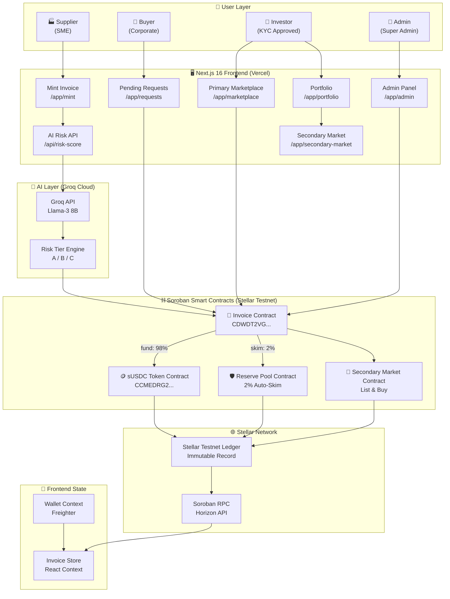
```mermaid
graph TB
    subgraph Users["👥 User Layer"]
        SUP["🏭 Supplier<br/>(SME)"]
        BUY["🏢 Buyer<br/>(Corporate)"]
        INV["💼 Investor<br/>(KYC Approved)"]
        ADM["🔐 Admin<br/>(Super Admin)"]
    end

    subgraph Frontend["🖥️ Next.js 16 Frontend (Vercel)"]
        MINT["Mint Invoice<br/>/app/mint"]
        REQ["Pending Requests<br/>/app/requests"]
        MKT["Primary Marketplace<br/>/app/marketplace"]
        PORT["Portfolio<br/>/app/portfolio"]
        SEC["Secondary Market<br/>/app/secondary-market"]
        ADMIN["Admin Panel<br/>/app/admin"]
        AI_ROUTE["AI Risk API<br/>/api/risk-score"]
    end

    subgraph AI["🤖 AI Layer (Groq Cloud)"]
        GROQ["Groq API<br/>Llama-3 8B"]
        RISK["Risk Tier Engine<br/>A / B / C"]
    end

    subgraph Soroban["⛓️ Soroban Smart Contracts (Stellar Testnet)"]
        INV_C["📄 Invoice Contract<br/>CDWDT2VG..."]
        TOKEN["🪙 sUSDC Token Contract<br/>CCMEDRG2..."]
        RES_P["🛡️ Reserve Pool Contract<br/>2% Auto-Skim"]
        SEC_M["🔄 Secondary Market Contract<br/>List & Buy"]
    end

    subgraph Stellar["🌐 Stellar Network"]
        LEDGER["Stellar Testnet Ledger<br/>Immutable Record"]
        RPC["Soroban RPC<br/>Horizon API"]
    end

    subgraph Store["💾 Frontend State"]
        CTX["Invoice Store<br/>React Context"]
        WALLET["Wallet Context<br/>Freighter"]
    end

    SUP --> MINT --> AI_ROUTE --> GROQ --> RISK --> INV_C
    BUY --> REQ --> INV_C
    INV --> MKT --> INV_C
    INV --> PORT --> SEC
    ADM --> ADMIN --> INV_C

    INV_C -->|"fund: 98%"| TOKEN
    INV_C -->|"skim: 2%"| RES_P
    INV_C --> SEC_M
    TOKEN --> LEDGER
    RES_P --> LEDGER
    SEC_M --> LEDGER
    LEDGER --> RPC --> CTX
    WALLET --> CTX
```

### Invoice Lifecycle State Machine

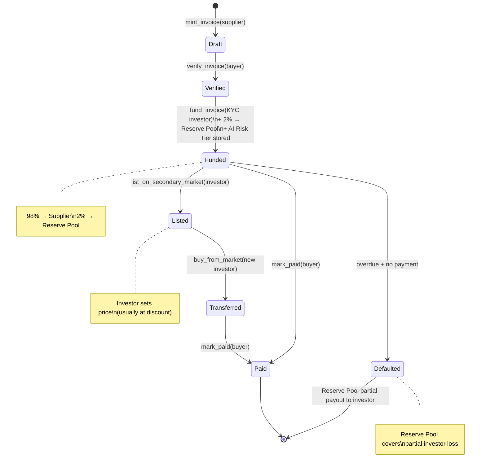
```mermaid
stateDiagram-v2
    [*] --> Draft : mint_invoice(supplier)
    Draft --> Verified : verify_invoice(buyer)
    Verified --> Funded : fund_invoice(KYC investor)\n+ 2% → Reserve Pool\n+ AI Risk Tier stored
    Funded --> Paid : mark_paid(buyer)
    Funded --> Defaulted : overdue + no payment
    Defaulted --> [*] : Reserve Pool partial payout to investor
    Paid --> [*]
    Funded --> Listed : list_on_secondary_market(investor)
    Listed --> Transferred : buy_from_market(new investor)
    Transferred --> Paid : mark_paid(buyer)

    note right of Funded : 98% → Supplier\n2% → Reserve Pool
    note right of Listed : Investor sets price\n(usually at discount)
    note right of Defaulted : Reserve Pool covers\npartial investor loss
```

### Project Structure

```text
Setu-v2/
├── .github/workflows/ci.yml         # CI/CD GitHub Actions (build + lint + Rust tests)
├── app/                             # Next.js 16 frontend
│   ├── api/
│   │   └── risk-score/route.ts      # ★ NEW: Groq AI risk scoring API endpoint
│   ├── app/
│   │   ├── mint/                    # Supplier: Tokenize invoices + AI scoring
│   │   ├── requests/                # Buyer: Verify invoices (Digital Handshake)
│   │   ├── marketplace/             # Investor: Fund verified invoices
│   │   ├── portfolio/               # Track investments + list on secondary market
│   │   ├── secondary-market/        # ★ NEW: Buy/sell funded invoice positions
│   │   └── admin/                   # ★ UPGRADED: Super-admin + delegate admin system
│   └── lib/
│       ├── soroban.ts               # Real Soroban blockchain integration
│       ├── stellar.ts               # Stellar utility functions
│       ├── invoice-store.tsx        # ★ UPGRADED: Secondary market + reserve pool state
│       └── wallet-context.tsx       # Freighter wallet connection
├── contracts/
│   ├── invoice/                     # ★ UPGRADED: Reserve Pool skim + AI Risk Tier storage
│   ├── reserve_pool/                # ★ NEW: Default protection pool contract (Rust)
│   ├── secondary_market/            # ★ NEW: Listing & trading contract (Rust)
│   └── token/                       # sUSDC Token smart contract (Rust)
└── packages/
    ├── invoice-client/              # Auto-generated TypeScript bindings
    └── token-client/                # Auto-generated TypeScript bindings
```

---

<a name="ai-pipeline"></a>
## 🤖 AI Risk Scoring Pipeline

Setu v2 integrates **Groq AI (Llama-3 8B)** to provide institutional-quality risk scoring on every invoice — directly at mint time.

### AI Architecture

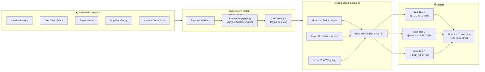
```mermaid
flowchart LR
    subgraph Input["📥 Invoice Parameters"]
        A1["Invoice Amount"]
        A2["Due Date / Tenor"]
        A3["Buyer Name"]
        A4["Supplier History"]
        A5["Invoice Description"]
    end

    subgraph API["🔌 Next.js API Route\n/api/risk-score"]
        B1["Request Validator"]
        B2["Prompt Engineering\nLlama-3 System Prompt"]
        B3["Groq API Call\nllama3-8b-8192"]
    end

    subgraph AI["🧠 Groq Cloud (Llama-3)"]
        C1["Financial Risk Analysis"]
        C2["Buyer Credit Assessment"]
        C3["Tenor Risk Weighting"]
        C4["Risk Tier Output: A / B / C"]
    end

    subgraph Output["📤 Result"]
        D1["Risk Tier A\n🟢 Low Risk < 3%"]
        D2["Risk Tier B\n🟡 Medium Risk 3–8%"]
        D3["Risk Tier C\n🔴 High Risk > 8%"]
        D4["Risk stored on-chain\nin Invoice struct"]
    end

    Input --> API
    B1 --> B2 --> B3
    B3 --> AI
    C1 & C2 & C3 --> C4
    C4 --> D1 & D2 & D3
    D1 & D2 & D3 --> D4
```

### Why AI + Blockchain?

- **AI** computes the risk score in real-time using LLM reasoning over invoice parameters.
- **Blockchain** makes the score immutable — stored in the Invoice struct on-chain, so it can never be altered after funding.
- Together they deliver **trustless, AI-augmented credit scoring** — one of Stellar's top 3 priority areas.

### Risk Tier Impact

| Risk Tier | Default Rate | Reserve Pool Impact | Investor Yield (Indicative) |
|:---:|:---:|:---:|:---:|
| 🟢 **A** | < 3% | Low draw-down | 4–6% APY |
| 🟡 **B** | 3–8% | Medium draw-down | 7–10% APY |
| 🔴 **C** | > 8% | High draw-down | 12–18% APY |

---

## 🛡️ Reserve Pool Architecture

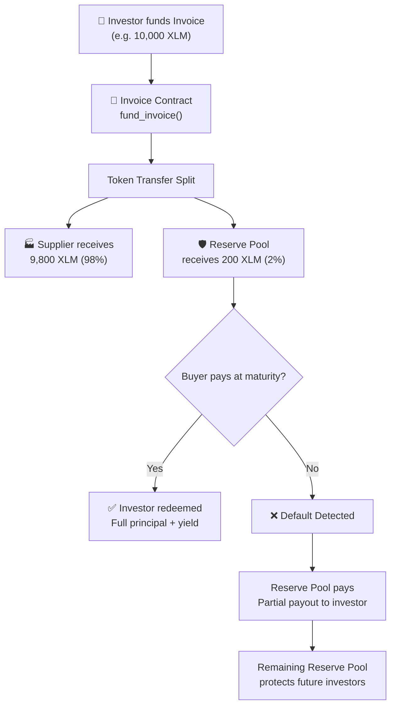
```mermaid
flowchart TD
    A["💼 Investor funds Invoice\n(e.g. 10,000 XLM)"]
    B["📄 Invoice Contract\nfund_invoice()"]
    C["Token Transfer Split"]
    D["🏭 Supplier receives\n9,800 XLM (98%)"]
    E["🛡️ Reserve Pool\nreceives 200 XLM (2%)"]
    F{"Buyer pays at maturity?"}
    G["✅ Investor redeemed\nFull principal + yield"]
    H["❌ Default Detected"]
    I["Reserve Pool pays\nPartial payout to investor"]
    J["Remaining Reserve Pool\nprotects future investors"]

    A --> B --> C
    C --> D
    C --> E
    E --> F
    F -- Yes --> G
    F -- No --> H --> I --> J
```

---

<a name="user-flow"></a>
## 👤 User Flow Architecture

### Complete User Journey Map

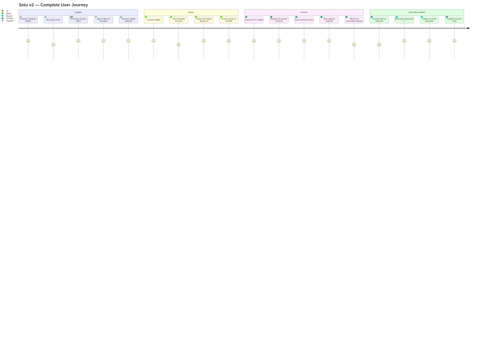
```mermaid
journey
    title Setu v2 — Complete User Journey
    section Supplier
      Connect Freighter Wallet: 5: Supplier
      Fill Invoice Form: 4: Supplier
      AI scores invoice A/B/C: 5: Supplier, AI
      Sign & Mint on Soroban: 5: Supplier
      Receive capital instantly: 5: Supplier
    section Buyer
      Connect Wallet: 5: Buyer
      View Pending Invoices: 4: Buyer
      Verify with Digital Signature: 5: Buyer
      Invoice moves to Verified: 5: Buyer
    section Investor
      Connect KYC Wallet: 5: Investor
      Browse AI-scored Invoices: 5: Investor
      Fund Verified Invoice: 5: Investor
      Earn yield at maturity: 5: Investor
      OR list on Secondary Market: 4: Investor
    section Secondary Market
      Investor lists at discount: 4: Investor
      New buyer discovers it: 5: Buyer2
      Instant on-chain purchase: 5: Buyer2
      Original investor exits: 5: Investor
```

### Role-Based Interaction Flow

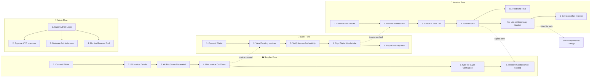
```mermaid
graph LR
    subgraph SUPPLIER["🏭 Supplier Flow"]
        S1["1. Connect Wallet"] --> S2["2. Fill Invoice Details"]
        S2 --> S3["3. AI Risk Score Generated"]
        S3 --> S4["4. Mint Invoice On-Chain"]
        S4 --> S5["5. Wait for Buyer Verification"]
        S5 --> S6["6. Receive Capital When Funded"]
    end

    subgraph BUYER["🏢 Buyer Flow"]
        B1["1. Connect Wallet"] --> B2["2. View Pending Invoices"]
        B2 --> B3["3. Verify Invoice Authenticity"]
        B3 --> B4["4. Sign Digital Handshake"]
        B4 --> B5["5. Pay at Maturity Date"]
    end

    subgraph INVESTOR["💼 Investor Flow"]
        I1["1. Connect KYC Wallet"] --> I2["2. Browse Marketplace"]
        I2 --> I3["3. Check AI Risk Tier"]
        I3 --> I4["4. Fund Invoice"]
        I4 --> I5["5a. Hold Until Paid"]
        I4 --> I6["5b. List on Secondary Market"]
        I6 --> I7["6. Sell to another investor"]
    end

    subgraph ADMIN["🔐 Admin Flow"]
        A1["1. Super Admin Login"] --> A2["2. Approve KYC Investors"]
        A1 --> A3["3. Delegate Admin Access"]
        A1 --> A4["4. Monitor Reserve Pool"]
    end

    S4 -.->|"invoice created"| B2
    B4 -.->|"invoice verified"| I2
    I4 -.->|"capital sent"| S6
    I6 -.->|"listed for sale"| SEC_MKT["Secondary Market\nListings"]
```

---

## 🔄 Complete Platform Pipeline

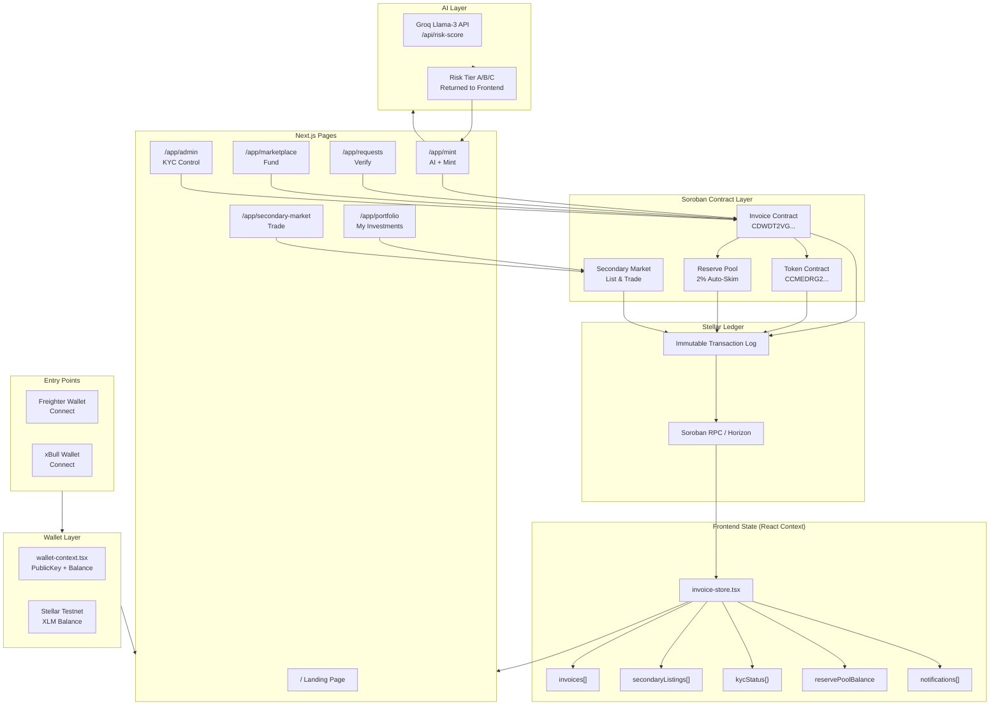
```mermaid
flowchart TD
    subgraph ENTRY["Entry Points"]
        E1["Freighter Wallet\nConnect"]
        E2["xBull Wallet\nConnect"]
    end

    subgraph WALLET["Wallet Layer"]
        W1["wallet-context.tsx\nPublicKey + Balance"]
        W2["Stellar Testnet\nXLM Balance"]
    end

    subgraph AI_LAYER["AI Layer"]
        AI1["Groq Llama-3 API\n/api/risk-score"]
        AI2["Risk Tier A/B/C\nReturned to Frontend"]
    end

    subgraph CONTRACT_LAYER["Soroban Contract Layer"]
        C1["Invoice Contract\nCDWDT2VG..."]
        C2["Token Contract\nCCMEDRG2..."]
        C3["Reserve Pool\n2% Auto-Skim"]
        C4["Secondary Market\nList & Trade"]
    end

    subgraph STATE["Frontend State (React Context)"]
        ST1["invoice-store.tsx"]
        ST2["invoices[]"]
        ST3["secondaryListings[]"]
        ST4["kycStatus{}"]
        ST5["reservePoolBalance"]
        ST6["notifications[]"]
    end

    subgraph PAGES["Next.js Pages"]
        P1["/ Landing Page"]
        P2["/app/mint\nAI + Mint"]
        P3["/app/requests\nVerify"]
        P4["/app/marketplace\nFund"]
        P5["/app/portfolio\nMy Investments"]
        P6["/app/secondary-market\nTrade"]
        P7["/app/admin\nKYC Control"]
    end

    subgraph LEDGER["Stellar Ledger"]
        L1["Immutable Transaction Log"]
        L2["Soroban RPC / Horizon"]
    end

    ENTRY --> WALLET
    WALLET --> PAGES
    P2 --> AI_LAYER --> AI2 --> P2
    P2 --> C1
    P3 --> C1
    P4 --> C1 --> C2 & C3
    P5 --> C4
    P6 --> C4
    P7 --> C1
    C1 & C2 & C3 & C4 --> L1 --> L2 --> ST1
    ST1 --> ST2 & ST3 & ST4 & ST5 & ST6
    ST1 --> PAGES
```

---

<a name="contract"></a>
## 🔗 Contract Credentials

| Category | Value |
|:--- |:--- |
| **Invoice Contract ID** | `CDWDT2VG2LSHG6D2JIEPN43UWF6NF3K5VV5RGDNIT2KF5NJJ3BWZEZIM` |
| **Token Contract ID** | `CCMEDRG2QBTQA27BPU4DAFOEWW2Q7WNINN6NZX4UUEBYBDJUG47THZP7` |
| **Token Init Tx Hash** | `59004728b4f2741782ec32f7f0d9a7b372ce0b754c2340c4b180adfe204b08d0` |
| **Invoice Init Tx Hash** | `6b1abd80675bb62d09e69a1296ac256d26d71210cc5128407f2e674da02536e6` |
| **Stellar Explorer** | [View Invoice Contract](https://stellar.expert/explorer/testnet/contract/CDWDT2VG2LSHG6D2JIEPN43UWF6NF3K5VV5RGDNIT2KF5NJJ3BWZEZIM) |
| **Network** | Stellar Testnet (Soroban) |

🔍 Verify transactions on [Stellar Expert Testnet](https://stellar.expert/explorer/testnet)

---

## ✅ Proof of Transactions

### Token Contract Initialization

| Field | Value |
|:---|:---|
| **Transaction Hash** | `59004728b4f2741782ec32f7f0d9a7b372ce0b754c2340c4b180adfe204b08d0` |
| **Function Called** | `initialize` |
| **Contract** | Token Contract (`CCMEDRG2...`) |
| **Status** | ✅ Success |
| **Network** | Stellar Soroban (Testnet) |

### Invoice Contract Initialization

| Field | Value |
|:---|:---|
| **Transaction Hash** | `6b1abd80675bb62d09e69a1296ac256d26d71210cc5128407f2e674da02536e6` |
| **Function Called** | `initialize` |
| **Contract** | Invoice Contract (`CDWDT2VG...`) |
| **Status** | ✅ Success |
| **Network** | Stellar Soroban (Testnet) |

🔗 [View Token Tx on Stellar Expert](https://stellar.expert/explorer/testnet/tx/59004728b4f2741782ec32f7f0d9a7b372ce0b754c2340c4b180adfe204b08d0)
🔗 [View Invoice Tx on Stellar Expert](https://stellar.expert/explorer/testnet/tx/6b1abd80675bb62d09e69a1296ac256d26d71210cc5128407f2e674da02536e6)

---

## 📸 Visual Proofs (Level 3 Submission)

### 1. Smart Contract Check
*These screenshots confirm the successful deployment of our WebAssembly (WASM) smart contracts on the Stellar Soroban network.*
<p align="center">
  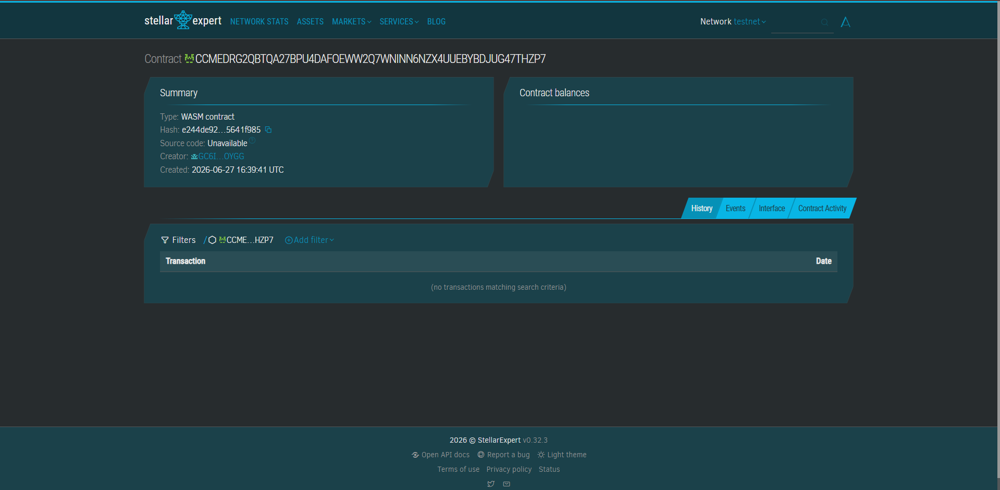
  
</p>

### 2. CI/CD Pipeline Green Status
*This screenshot confirms our automated GitHub Actions workflow successfully runs frontend builds and smart contract unit tests.*
<p align="center">
  
</p>

### 3. Smart Contract Unit Tests
*All 6/6 Rust-based Soroban smart contract unit tests pass — including the full invoice lifecycle with token transfer and KYC enforcement.*
<p align="center">
  
</p>

### 4. Mobile Responsiveness
*These screenshots demonstrate that the UI is fully responsive and optimized for mobile devices.*
<p align="center">
  
  
</p>

---

<a name="error-handling"></a>
## ⚠️ Error Handling (3 Types)

| Error Type | Trigger | User Feedback |
|:--- |:--- |:--- |
| **User Rejected** | User clicks "Cancel" in Freighter | `"Transaction Rejected by User"` notification |
| **KYC Not Approved** | Investor tries to fund without KYC | Blocks funding, shows `"KYC Required"` modal |
| **Contract / Network Error** | Invalid state or RPC failure | Shows specific on-chain error message |

The contract defines 8 typed `SetuError` variants for granular error handling:

```rust
pub enum SetuError {
    NotAuthorized       = 1,
    InvoiceNotFound     = 2,
    InvalidStatus       = 3,
    KycNotApproved      = 4,
    InvalidAmount       = 5,
    AlreadyInitialized  = 6,
    InvoiceAlreadyVerified = 7,
    InvoiceAlreadyFunded   = 8,
}
```

---

## 🧪 Smart Contract Functions

### Invoice Contract (v2 — Upgraded)

- **`initialize(admin, token_contract, reserve_pool)`** — Sets up contract with admin, token, and reserve pool addresses.
- **`mint_invoice(supplier, buyer, amount, description, due_date, risk_tier)`** — Creates a new `Draft` invoice with AI-computed risk tier on-chain.
- **`verify_invoice(buyer, invoice_id)`** — Buyer digitally signs to verify invoice authenticity (Draft → Verified).
- **`fund_invoice(investor, invoice_id)`** — KYC-approved investor funds a Verified invoice; 98% goes to supplier, 2% to Reserve Pool.
- **`mark_paid(caller, invoice_id)`** — Admin or buyer marks a funded invoice as Paid.
- **`approve_kyc(admin, investor)`** — Admin grants KYC approval to an investor address.
- **`revoke_kyc(admin, investor)`** — Admin revokes KYC from an investor address.
- **`is_kyc_approved(investor)`** — Read-only check of investor KYC status.
- **`get_invoice(invoice_id)`** — Fetch full invoice data by ID including risk tier.
- **`get_invoice_count()`** — Returns total invoices minted.

### Reserve Pool Contract (v2 — NEW)
- **`deposit(from, amount)`** — Accepts 2% skim from each funded invoice.
- **`payout(to, amount)`** — Admin-triggered payout to investor on verified default.
- **`get_balance()`** — Returns current reserve pool balance.

### Secondary Market Contract (v2 — NEW)
- **`list_invoice(seller, invoice_id, price)`** — Seller lists their funded position for sale at a set price.
- **`buy_invoice(buyer, listing_id)`** — Buyer purchases a listed invoice position.
- **`cancel_listing(seller, listing_id)`** — Seller cancels their active listing.
- **`get_listings()`** — Returns all active market listings.

### Token Contract (`sUSDC`)

- **`initialize(admin, decimal, name, symbol)`** — Initializes the sUSDC token.
- **`mint(to, amount)`** — Admin mints sUSDC tokens to an address.
- **`transfer(from, to, amount)`** — Transfers sUSDC between accounts.
- **`balance(id)`** — Returns sUSDC balance for an address.

---

## 🛠️ Tech Stack

- **[Rust](https://doc.rust-lang.org/book/)** — Core language for Soroban smart contracts.
- **[Soroban SDK v22](https://developers.stellar.org/docs/tools/sdks/library)** — Stellar smart contract framework.
- **[Next.js 16](https://nextjs.org/)** — React framework for the enterprise frontend with Turbopack.
- **[Groq AI (Llama-3 8B)](https://groq.com/)** — Ultra-fast LLM inference for real-time risk scoring.
- **[Vanilla CSS](https://developer.mozilla.org/en-US/docs/Web/CSS)** — Custom design system with glassmorphism and neon aesthetics.
- **[Stellar CLI](https://developers.stellar.org/docs/tools/developer-tools/stellar-cli)** — Build, deploy, and invoke contracts.
- **[@stellar/freighter-api](https://www.npmjs.com/package/@stellar/freighter-api)** — Freighter wallet integration.
- **[Stellar Expert](https://stellar.expert/explorer/testnet)** — On-chain transaction explorer.

### 💳 Supported Wallets
- **Freighter** ✅ (Fully integrated)
- **xBull** (Compatible via freighter-api adapter)

---

<a name="cicd"></a>
## 🛠️ CI/CD Pipeline (GitHub Actions)

Every push to `main` automatically triggers the full build, lint, and smart contract test pipeline.

**Pipeline Stages:**
1. **Checkout**: Clones the latest code.
2. **Node.js Setup**: Installs Node 20 with npm caching.
3. **Install Dependencies**: Runs `npm install`.
4. **Build**: Runs `npm run build` to ensure the app compiles cleanly.
5. **Lint**: Runs `npm run lint` to enforce code quality.
6. **Rust Setup**: Installs Rust and the `wasm32v1-none` target.
7. **Smart Contract Tests**: Runs `cargo test` — all 6/6 tests must pass.

### Pipeline Workflow

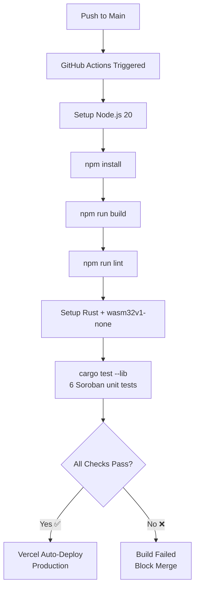
```mermaid
flowchart TD
    A["Push to Main"] --> B["GitHub Actions Triggered"]
    B --> C["Setup Node.js 20"]
    C --> D["npm install"]
    D --> E["npm run build"]
    E --> F["npm run lint"]
    F --> G["Setup Rust + wasm32v1-none"]
    G --> H["cargo test --lib\n6 Soroban unit tests"]
    H --> I{"All Checks Pass?"}
    I -- "Yes ✅" --> J["Vercel Auto-Deploy\nProduction"]
    I -- "No ❌" --> K["Build Failed\nBlock Merge"]
```

> View the live pipeline status in the **Actions** tab of the [GitHub repository](https://github.com/sohansarkar07/Setu/actions).

---

## 📱 Mobile Responsiveness

The application is fully optimized for all screen sizes:
- **Responsive Sidebar**: Collapses into a bottom navigation bar on mobile.
- **Adaptive Cards**: Invoice cards stack vertically on small screens.
- **Touch-Friendly**: All buttons and inputs are touch-optimized for mobile use.

---

<a name="setup"></a>
## ⚙️ Quick Start

### Prerequisites
- Node.js 20+
- Rust + `wasm32v1-none` target
- Stellar CLI (`cargo install stellar-cli`)
- [Freighter Wallet](https://freighter.app) browser extension
- Groq API Key (free at [console.groq.com](https://console.groq.com))

### 1. Clone & Install

```bash
git clone https://github.com/sohansarkar07/Setu.git
cd Setu
npm install
```

### 2. Environment Setup

Create `.env.local` in the project root:

```env
NEXT_PUBLIC_INVOICE_CONTRACT_ID=CDWDT2VG2LSHG6D2JIEPN43UWF6NF3K5VV5RGDNIT2KF5NJJ3BWZEZIM
NEXT_PUBLIC_TOKEN_CONTRACT_ID=CCMEDRG2QBTQA27BPU4DAFOEWW2Q7WNINN6NZX4UUEBYBDJUG47THZP7
GROQ_API_KEY=your_groq_api_key_here
```

### 3. Run the App

```bash
npm run dev
# Open http://localhost:3000
```

### 4. Build Smart Contracts (Optional)

```bash
# Install Rust wasm target
rustup target add wasm32v1-none

# Compile contracts
cd contracts
stellar contract build

# Deploy to testnet
stellar keys generate deployer --network testnet --fund
stellar contract deploy \
  --wasm target/wasm32v1-none/release/setu_invoice.wasm \
  --source deployer \
  --network testnet
```

### 5. Using the App

1. **Connect Freighter Wallet** — Click "Connect Wallet" on any page.
2. **Mint an Invoice** (as Supplier) — Go to `/app/mint`, fill in invoice details. AI will auto-score the risk tier.
3. **Verify an Invoice** (as Buyer) — Go to `/app/requests`, click "Approve", sign with Freighter.
4. **Fund an Invoice** (as Investor) — Go to `/app/marketplace`, browse AI-scored invoices, click "Fund".
5. **Trade on Secondary Market** — Go to `/app/portfolio`, list your position. Others can buy on `/app/secondary-market`.
6. **Admin KYC** — Go to `/app/admin` (authorized wallet only) to manage KYC approvals.

---

## 🔐 Access Control & Security

- **KYC Gating**: Only admin-approved investor addresses can call `fund_invoice`. This prevents unauthorized capital deployment.
- **Role Separation**: Suppliers, buyers, and investors have distinct, non-overlapping permissions.
- **Super-Admin System**: A single master wallet controls admin delegation. Other admins can be granted and revoked dynamically.
- **No Private Keys in UI**: All transaction signing happens exclusively inside the Freighter browser extension. No secrets ever touch the frontend.
- **AI Score Immutability**: Once stored on-chain in the Invoice struct, the AI risk tier cannot be altered.

---

## 🚧 Roadmap & Future Plans

- [x] **Level 3**: Invoice tokenization, KYC gating, CI/CD, deployed contracts
- [x] **Level 4**: Reserve Pool, AI Risk Scoring, Secondary Market, Admin system
- [ ] **Mainnet Deployment**: Deploy to Stellar Mainnet with real USDC integration
- [ ] **Invoice NFTs**: Represent each funded invoice as a transferable Soroban NFT
- [ ] **Yield Calculation**: Automatic on-chain APY calculation for investors
- [ ] **IPFS Document Storage**: Store invoice PDFs on IPFS with on-chain CID verification
- [ ] **DAO Governance**: Community voting on KYC policy, reserve pool ratios, and fee structures
- [ ] **Multi-Chain Bridge**: Cross-chain invoice asset bridging to Ethereum and Polygon
- [ ] **Mobile App**: React Native app with Freighter mobile wallet integration
- [ ] **Institutional API**: REST API for enterprise ERP integration (SAP, Oracle)

---

## 👨‍💻 Author

**Sohan Sarkar**
- Blockchain Enthusiast | Soroban Developer
- [GitHub Profile](https://github.com/sohansarkar07)
